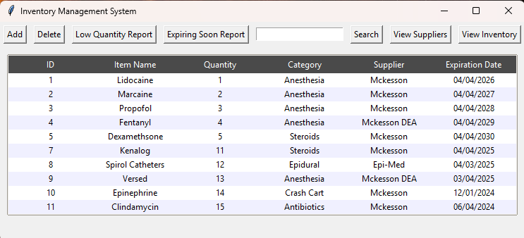
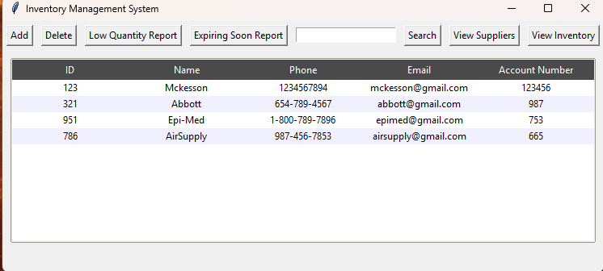
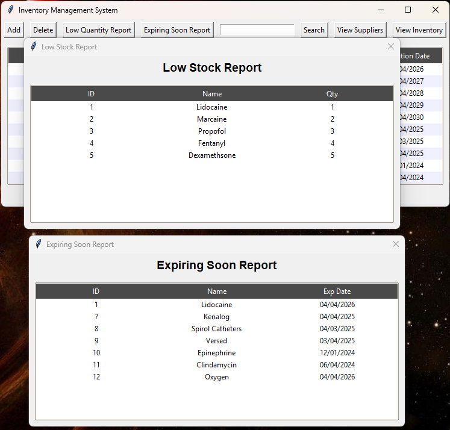

# Inventory & Supplier Management System

A Python/SQLite desktop application built for a clinical procedure environment to track medical supply inventory, monitor expiration dates, and prevent stockouts.

**Deployed in a live clinical setting, where it reduced annual supply costs by approximately $70,000** through expiration-waste elimination and stockout prevention.

---

## Screenshots

### Main Inventory View


### Supplier View


### Reports — the $70K


*Left: items at or below reorder threshold (quantity ≤ 10). Right: items expiring within the next 30 days. These two reports are the core of the cost-saving workflow — they turn reactive supply management into proactive management.*

---

## Features

- **Full CRUD** on inventory and supplier records
- **Low Stock Report** — surfaces items at or below a reorder threshold to prevent mid-procedure stockouts
- **Expiring Soon Report** — surfaces items expiring within 30 days so they can be used before they're discarded
- **Partial-match search** across inventory or supplier tables
- **Input validation** — regex-based phone and email validation, date-format enforcement, non-negative quantity checks
- **Relational integrity** — foreign-key relationship between inventory and supplier tables
- **Audit trail schema** — `txn_history` table captures stock changes for future reporting
- **Persistent window geometry** — remembers user's preferred window size/position across sessions

## Tech Stack

- **Language:** Python 3
- **GUI:** Tkinter + ttk (clam theme, themed Treeview, modal dialogs)
- **Database:** SQLite 3
- **Validation:** `re` module for regex validation, `datetime` for date handling

## Database Schema

supplier (supplier_id PK, supplier_name, phone, email, account_number)
inventory (item_id PK, item_name, quantity, category, supplier_id FK, expiration_date)
category (category_id PK, cat_name UNIQUE)
txn_history (txn_id PK, item_id FK, change_qty, txn_date)
user (user_id PK, username UNIQUE, role)


## How to Run

```bash
# Clone the repo
git clone https://github.com/chagood1/inventory-management-system.git
cd inventory-management-system

# Run it (Tkinter and sqlite3 ship with Python — no install needed)
python FinalProject_Hagood_Clay_CIS_3365.py
```

The included `inventory.db` contains realistic but entirely fictional demo data (fake supplier names, emails, and phone numbers).

## Project Context

Originally built as the final project for **CIS 3365 (Database Systems)** at Texas A&M University–Central Texas. Subsequently adapted and deployed in a live clinical procedure environment, where it replaced a manual supply-tracking workflow and produced approximately $70,000 in annual cost savings through reduced expiration waste and eliminated stockouts.

## Author

**Clayton Hagood** — [LinkedIn](https://linkedin.com/in/clayton-hagood-5781152bb) · [GitHub](https://github.com/chagood1)

## License

MIT — see [LICENSE](LICENSE)